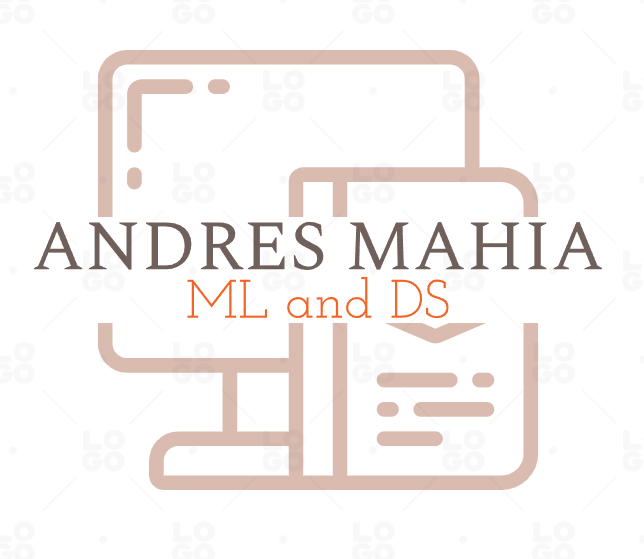

[![LinkedIn][linkedin-shield]][linkedin-url]

<!-- PROJECT LOGO -->
 

  

<h3 align="center">Canadian Crash Accidents Prediction</h3>

  

    project_description
     
    <a href="https://github.com/AMM53/ProyectoML"><strong>Explore the docs »</strong></a>
     
     
    <a href="https://github.com/AMM53/ProyectoML">View Demo</a>
    ·
    <a href="https://github.com/AMM53/ProyectoML/issues">Report Bug</a>
    ·
    <a href="https://github.com/AMM53/ProyectoML/issues">Request Feature</a>
  

<!-- TABLE OF CONTENTS -->

  
Table of Contents

  <ol>
    <li>
      <a href="#about-the-project">About The Project</a>
      <ul>
        <li><a href="#built-with">Built With</a></li>
      </ul>
    </li>
    <li>
      <a href="#getting-started">Getting Started</a>
      <ul>
        <li><a href="#prerequisites">Prerequisites</a></li>
      </ul>
    </li>
    <li><a href="#roadmap">Roadmap</a></li>
    <li><a href="#contributing">Contributing</a></li>
    <li><a href="#contact">Contact</a></li>
    <li><a href="#acknowledgments">Acknowledgments</a></li>
  </ol>

<!-- ABOUT THE PROJECT -->
## About The Project

[![Product Name Screen Shot][product-screenshot]](https://example.com)

Project for our Machine Learning class at CUNEF, Madrid.
Objective was to develop a prediction analysis based on machine learning models for the Canada Crash Accidents dataset, for which you can find the Kaggle competition here: https://www.kaggle.com/tbsteal/canadian-car-accidents-19942014
### Built With

*  Jupyter Notebook
*  VSCode
*  Python 3.8.12

(<a href="#top">back to top</a>)

<!-- GETTING STARTED -->
## Getting Started

### Prerequisites

* Python 3.8.12
* Wanting to learn something new (just like we did! and still do)

<!-- ROADMAP -->
## Roadmap

- [X] EDA
- [X] Feature Engineering
- [X] Models
    - [X] Model Optimization
    - [X] Pipeline for preprocessing
- [X] Interpretability
- English translation

See the [open issues](https://github.com/AMM53/ProyectoML/issues) for a full list of proposed features (and known issues).

(<a href="#top">back to top</a>)

<!-- CONTRIBUTING -->
## Contributing

Contributions are what make the open source community such an amazing place to learn, inspire, and create. Any contributions you make are **greatly appreciated**.

If you have a suggestion that would make this better, please fork the repo and create a pull request. You can also simply open an issue with the tag "enhancement".
Don't forget to give the project a star! Thanks again!

1. Fork the Project
2. Create your Feature Branch (`git checkout -b feature/AmazingFeature`)
3. Commit your Changes (`git commit -m 'Add some AmazingFeature'`)
4. Push to the Branch (`git push origin feature/AmazingFeature`)
5. Open a Pull Request

(<a href="#top">back to top</a>)

<!-- CONTACT -->
## Contact

Andrés Mahia Morado - andresmahiamorado@gmail.com

Project Link: [https://github.com/AMM53/ProyectoML](https://github.com/AMM53/ProyectoML)

(<a href="#top">back to top</a>)

<!-- ACKNOWLEDGMENTS -->
## Acknowledgments

* Antonio Tello Gómez for working as hard on this project as I did

(<a href="#top">back to top</a>)

<!-- MARKDOWN LINKS & IMAGES -->
<!-- https://www.markdownguide.org/basic-syntax/#reference-style-links -->
[contributors-shield]: https://img.shields.io/github/contributors/AMM53/ProyectoML.svg?style=for-the-badge
[contributors-url]: https://github.com/AMM53/ProyectoML/graphs/contributors
[forks-shield]: https://img.shields.io/github/forks/AMM53/ProyectoML.svg?style=for-the-badge
[forks-url]: https://github.com/AMM53/ProyectoML/network/members
[stars-shield]: https://img.shields.io/github/stars/AMM53/ProyectoML.svg?style=for-the-badge
[stars-url]: https://github.com/AMM53/ProyectoML/stargazers
[issues-shield]: https://img.shields.io/github/issues/AMM53/ProyectoML.svg?style=for-the-badge
[issues-url]: https://github.com/AMM53/ProyectoML/issues
[license-shield]: https://img.shields.io/github/license/AMM53/ProyectoML.svg?style=for-the-badge
[license-url]: https://github.com/AMM53/ProyectoML/blob/master/LICENSE.txt
[linkedin-shield]: https://img.shields.io/badge/-LinkedIn-black.svg?style=for-the-badge&logo=linkedin&colorB=555
[linkedin-url]: https://linkedin.com/in/andresmahia
[product-screenshot]: https://www.ctvnews.ca/polopoly_fs/1.4697281.1574439412!/httpImage/image.png_gen/derivatives/landscape_960/image.png

